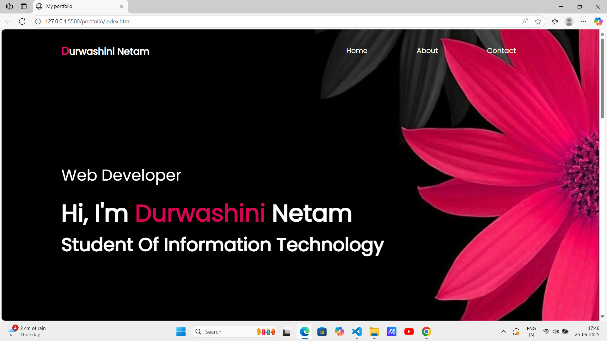
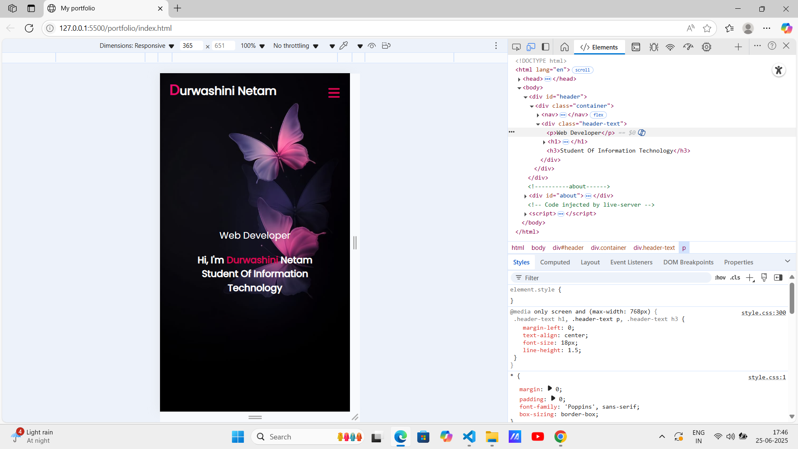

# 🌐 Personal Portfolio Website

This is a **responsive personal portfolio website** built using **HTML and CSS** as part of the **CodSoft Web Development Internship – Task 1 (Level 1)**.

## 📌 Task Objective

Create a personal portfolio webpage that includes details like:

- Introduction/About Me
- Skills
- Projects
- Resume section (Downloadable)
- Contact information
- Clean UI and responsive design

## 🔧 Tech Stack

- HTML5
- CSS3
- Google Fonts (Poppins)
- GitHub Pages (for deployment)

## 💡 Features

- Fully responsive layout
- Stylish and clean design
- Resume download button
- Section-based navigation
- Links to GitHub and LinkedIn

## 📸 Screenshots

| Desktop View | Mobile View |
|--------------|-------------|
|  |  |

> 📌 *Replace above image names with your actual screenshots!*

## 🚀 Live Demo

Click here to view the live version of the portfolio:  
🔗 [Live Portfolio Website](https://durwashini-Netam.github.io/CODSOFT/Task1/)

> *Update the link above after deployment if needed.*

## 📝 Author

**Durwashini Netam**  
📧 durwashininetam@gmail.com  
🔗 [LinkedIn](https://www.linkedin.com/in/durwashini-netam-146b2a29b/)  
🐙 [GitHub](https://github.com/Durwashini-Netam)

